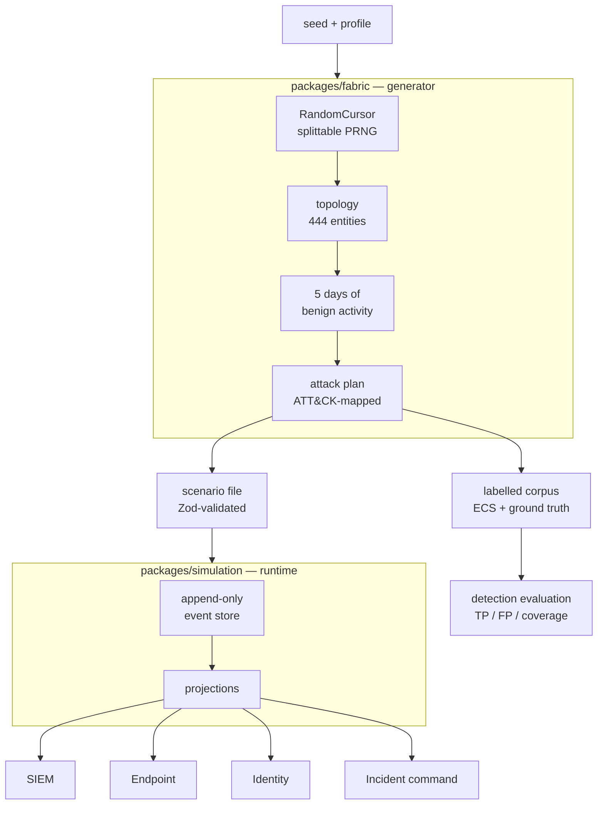

# Endomorph

**Endomorph generates realistic enterprise security telemetry with ground truth known by construction.**

A corpus captured from a real network has to be labelled by hand, and the labels are opinions. Here the generator decided which events were the intrusion before it wrote them — so every record is labelled benign or malicious, mapped to the ATT&CK technique it demonstrates, and reproducible from a seed.

That makes two things possible that a captured corpus cannot support:

- **Detection engineering with real numbers.** Score a rule against known ground truth and get true positives, false positives, and technique coverage instead of an estimate.
- **Investigation training that cannot be memorised.** Change the seed and the enterprise, the staff, the addresses, and the intrusion all change — while the reasoning required stays the same.

```
pnpm evaluate     # score the shipped ruleset against three ATT&CK-mapped intrusions
pnpm dev          # investigate one of them in the analyst console
```

## Why this is hard, and how it works

Determinism is the whole product. If the same seed produced a slightly different world, labels would drift from the data and every number above would be worthless.

The non-obvious part is that a single seeded PRNG is *not* enough. Drawing sequentially means adding one more device shifts every subsequent value, so editing content silently rewrites unrelated parts of the world. Endomorph uses a **splittable cursor** addressed by fork path rather than draw order:

```
root(seed)
  └── staff
        └── finance
              └── member-3      ← this person's stream, forever
```

Sibling streams cannot disturb each other and fork order is irrelevant. Raising headcount by one adds a person without changing anyone else's name, device, or account.



Everything downstream is derived. The SIEM, endpoint, and identity consoles are **projections of one event history**, not separate datasets — which is why a pivot in one tool lands on the same event in another, and why the incident-command graph can assemble itself from whatever evidence the analyst collected.

Content is data, not code. An attack plan declares its steps, techniques, and questions; the renderer plays it against whatever enterprise the seed produced. Adding an intrusion means adding a plan — and because plans pass through Zod validation, semantic reference checks, the runtime's own event validator, and the determinism suite, **generated content cannot corrupt the runtime**.

## Try Endomorph

**Hosted app:** https://wallfacerj.github.io/endomorph/

The hosted build is deployed from `main` with GitHub Pages. If the deployment is temporarily unavailable, use the local quick start below.

For a first-time test, you do not need to read the repository first. Open **Quick test** inside the app and follow the five-minute flow, or use [TESTER_GUIDE.md](TESTER_GUIDE.md) for the same short procedure plus optional deeper checks.

## What ships today

Endomorph includes:

- one deterministic synthetic enterprise world per scenario;
- shared identity, EDR, and SIEM projections over the same event history;
- an alert-first analyst workspace with SIEM, endpoint, identity, and incident-command views;
- a Case that assembles the incident picture from collected evidence: an evidence graph, extracted indicators, incident phase, hypotheses, tasks, and decisions;
- evidence collection by immutable event ID;
- analyst-authored findings linked to collected evidence;
- multiple deterministic response choices, including an intentionally harmful choice;
- explicit investigation finalization with success/failure and partial completion;
- transparent objective score, response-quality penalty, and final score;
- a read-only finalized case until reset;
- post-finalization instructor ground-truth review;
- four scenarios selectable in the UI, three hand-authored and one generated;
- two persisted professional interface styles: **Midnight SOC** and **Graphite**;
- deterministic replay/unit/integration coverage plus browser-level Playwright tests;
- a deterministic enterprise generator (`packages/fabric`) producing hundreds of coherent entities and thousands of benign events from a seed.

## Included scenarios

| Scenario | Entities | Events | Notes |
| --- | --- | --- | --- |
| **Finance account compromise** | 15 | 34 | Suspicious login, encoded PowerShell, correlated outbound activity. Default. |
| **HR malware beacon** | 7 | 6 | Compromised HR session, unsigned executable, outbound beacon. |
| **Cloud-admin compromise** | 7 | 6 | Privileged identity compromise and suspicious administrative tooling. |
| **Generated: external credential compromise** | 444 | ~17.9k | Password spray from hosting infrastructure, encoded PowerShell, C2 beacon, lateral movement. |
| **Generated: privileged insider** | 444 | ~17.8k | No external address anywhere. A valid admin account, its own workstation, deviation from its own baseline. |
| **Generated: service account abuse** | 444 | ~17.8k | A valid privileged credential used from a host it has no history with. All traffic internal. |

The first three are hand-authored and deliberately small. The rest are generated.

The three generated incidents deliberately teach different lessons. The first trains the obvious heuristic — an unfamiliar external address is suspicious. The second breaks it: everything originates from a legitimate admin on their own workstation, and the only signal is deviation from that person's own baseline. The third breaks it again: the credential is valid and the traffic is internal, but the account is being used from a host it has never authenticated from. An analyst who learns "look for the foreign IP" from the first will fail the other two.

Generated scenarios are **build artifacts, not source** — `pnpm build` produces them and they are not committed.

Use the **Scenario** selector in the application to switch between them. Direct deep links using `?scenario=/scenarios/<file>.json` are also supported for local/custom authoring.

## Detection engineering

```bash
pnpm evaluate                          # score the shipped ruleset
pnpm evaluate -- --export out/corpus   # also write NDJSON + manifest
```

Rules are evaluated against all three intrusions, because a rule's false positives come from the incidents it *wasn't* written for. Sample output:

```
External credential compromise  (credential-compromise)
  corpus 4045 records, 13 malicious (0.321%)

  RULE                      TECHNIQUE   TP   FP     FN   PREC    RECALL
  auth-spray                T1110.003   4    0      0    1.000   1.000
  encoded-powershell        T1059.001   1    0      0    1.000   1.000
  naive-powershell          T1059.001   1    51     0    0.019   1.000
  external-auth-success     T1078.002   1    0      1    1.000   0.500

  techniques covered   4/7
  UNCOVERED            T1005, T1021.002, T1071.001
```

Two of the shipped rules are deliberately imperfect, and the numbers say so. `naive-powershell` alerts on every PowerShell launch and scores **0.019 precision** — 1 true positive against 51 false. `external-auth-success` scores perfectly on the credential-compromise plan and **detects nothing at all** on the service-account plan, because that intrusion never leaves the corporate network.

Corpora export as newline-delimited JSON in Elastic Common Schema field names, with a manifest recording the seed, the plan, technique counts, and the malicious ratio.

## Generating an enterprise

```bash
pnpm generate:scenario
```

That rebuilds `apps/web/public/scenarios/generated-enterprise.json` from a seed. The same flags always produce byte-identical output.

```bash
pnpm generate:scenario -- \
  --seed 4242 \
  --headcount 250 \
  --organization "Northwind Health" \
  --domain northwind.test \
  --out apps/web/public/scenarios/northwind.json
```

| Flag | Default | Meaning |
| --- | --- | --- |
| `--seed` | `20260820` | Root seed. Everything derives from it. |
| `--headcount` | `120` | Staff, distributed across nine weighted departments. |
| `--organization` | `Acme Financial` | Company name. |
| `--domain` | `acme.test` | Email/UPN domain. |
| `--start-time` | `2026-08-20T08:00:00.000Z` | Virtual start of the working day. |
| `--duration-hours` | `10` | Length of each generated working day. |
| `--out` | `apps/web/public/scenarios/generated-enterprise.json` | Output path, relative to the repository root. |
| `--plan` | chosen by seed | `credential-compromise`, `privileged-insider`, or `service-account-abuse`. |
| `--pretty` | off | Indent the JSON. Roughly doubles file size. |

Register a new file in `apps/web/src/scenarioLoader.ts` to make it appear in the selector, or open it directly with `?scenario=/scenarios/<file>.json`.

### Why history matters

The generator produces **five consecutive days**, and the intrusion lands on the last one. Every earlier day is untouched baseline.

That is what makes an observation anomalous rather than merely unusual-looking. Each staff member keeps stable habits across the history — the same workstation, the same source address, a habitual handful of applications, a recognisable arrival time — and varies only within them. Weekends are quiet.

So when the compromised account signs in from `91.219.236.18`, an analyst can establish that the account has *never* used that address, on any prior day. Against a single day of telemetry that question has no answer.

Try it: open the generated scenario, go to **SIEM Search**, and query `sourceIp:91.219.236.18`. Five events out of 17,904 — four failed sign-ins, then a success.

### How determinism is guaranteed

Generation draws from a **splittable random cursor** rather than a single sequential stream. A cursor is addressed by its fork path — `staff/finance/member-3` — not by how many values have been drawn before it. Sibling streams cannot disturb each other, and fork order does not matter.

The practical consequence: raising `--headcount` by one adds a person without rewriting anyone else's name, device, or account. Editing content does not resequence the world.

## Student workflow

A normal run is intentionally simple:

1. Open the alert and investigate what happened.
2. Collect useful evidence and optionally write a case finding.
3. Choose the response action(s) you think are appropriate.
4. Finalize the investigation.
5. Review the result and score.

Student mode does not reveal ground truth or authored response-quality rationale before submission.

## Replay

Every console is a projection of one append-only event log, so point-in-time replay is a prefix replay rather than stored snapshots. Scrub the timeline and the SIEM, endpoint, identity, and case views all show that moment together — rewind past the alert and watch the intrusion arrive instead of reconstructing it backwards from the end.

Response actions are disabled while rewound. Acting on a past state would either rewrite history or silently apply to the present, and both are worse than refusing.

## Instructor walkthrough

Switch the **Role** control to Instructor and open **Walkthrough**. It reconstructs the incident step by step from ground truth: what happened, which console to look in, the ATT&CK technique, and a query to try.

Steps reveal one at a time on an explicit click — collapsed steps show only the console name, so the shape of the incident is visible without the content. **Pop out** detaches it into a separate window for a second monitor or a projector, rendered through a portal so it stays in sync with the run.

Students get the walkthrough after finalizing; instructors get it during.

## Professional and guided modes

Runs default to **professional**: no live objective checklist and no running score while you work. The evidence, tools, and response actions are identical — only the answer key is absent. Assessment appears in full once you finalize.

**Guided** restores the checklist and running score for onboarding, layered onto the same environment rather than a separate, simpler product. Switch with the **Mode** control; the choice persists across reloads.

## Instructor mode

Use the **Instructor mode** control in the app, or add `?mode=instructor` to a scenario URL. Ground truth is shown only after the investigation is finalized.

Instructor mode is a **presentation boundary, not an authentication/security boundary** in v1. The current product is a local/static client application. Do not use this mode to protect assessment answers in a real classroom deployment; real role enforcement belongs in a future server-backed runtime.

## Local quick start

Requirements:

- Node.js 24
- pnpm 11.22.0 (the repository declares the package-manager version)

```bash
git clone https://github.com/WallFacerJ/endomorph.git
cd endomorph
pnpm install --frozen-lockfile
pnpm dev
```

Open the Vite URL printed in the terminal, normally `http://localhost:5173`.

## Validation commands

```bash
pnpm build
pnpm lint
pnpm test:run
```

For browser regression tests:

```bash
pnpm exec playwright install chromium
pnpm test:e2e
```

CI runs frozen dependency installation, build, lint, deterministic unit/integration tests, and the Chromium Playwright suite.

## First-time user testing

For a friend or first-time tester, the preferred procedure is deliberately short:

1. Share the hosted app: https://wallfacerj.github.io/endomorph/
2. Ask them to stay in **Student mode** and use the in-product **Quick test** menu.
3. Do not tell them the correct investigation or response path.
4. After they finalize, ask where they hesitated, whether the result made sense, and what one thing they would change.

That five-minute pass is enough to produce useful usability feedback. [TESTER_GUIDE.md](TESTER_GUIDE.md) contains optional deeper checks and a copy/paste feedback template for testers who want to do more.

## Scenario authoring

Shipped scenarios live in `apps/web/public/scenarios/` and use the versioned `endomorph-scenario` JSON contract. The scenario compiler performs structural validation with Zod, semantic world/event/reference validation, deterministic replay validation, objective validation, response-action validation, and ground-truth reference validation before a scenario is allowed into the workspace.

See [SCENARIO_AUTHORING.md](SCENARIO_AUTHORING.md) for the authoring contract and workflow.

## Architecture boundaries

Endomorph deliberately keeps these concepts separate:

- **World state** is the canonical synthetic enterprise state.
- **Simulation events** form append-only deterministic history.
- **Identity / EDR / SIEM** are projections of shared history, not private sources of truth.
- **Analyst case state** stores collected event IDs and analyst-authored findings, not duplicated canonical telemetry.
- **Objectives** grade resulting canonical state.
- **Response-quality penalties** come only from declarative scenario metadata for performed actions.
- **Ground truth** is authored assessment metadata and is not student-visible during an active investigation.

The current hosted application is intentionally client-only and in-memory. Refreshing the page starts a fresh run. Durable users/runs, real authentication/authorization, persistence, plugins, and server APIs are post-v1 work.

## Safety boundary

Endomorph is for synthetic simulation only. It is not a phishing kit, credential-capture system, arbitrary code-execution framework, or production security-control platform. Do not enter real credentials, secrets, personal information, or production incident data into test findings.

## Repository map

- `apps/web` — React + TypeScript + Vite analyst/instructor experience
- `packages/domain` — canonical synthetic enterprise domain models
- `packages/schema` — versioned external/scenario validation contracts
- `packages/simulation` — deterministic world/event/replay/projection/scenario runtime
- `packages/fabric` — the generator: splittable RNG, topology, background activity, the attack-plan library, labelled corpus export, detection-rule evaluation, and the CLIs
- `e2e` — Playwright browser regression tests

For architectural continuity and future work, see [PROJECT_STATE.md](PROJECT_STATE.md), [ROADMAP.md](ROADMAP.md), and [ARCHITECTURE.md](ARCHITECTURE.md).
