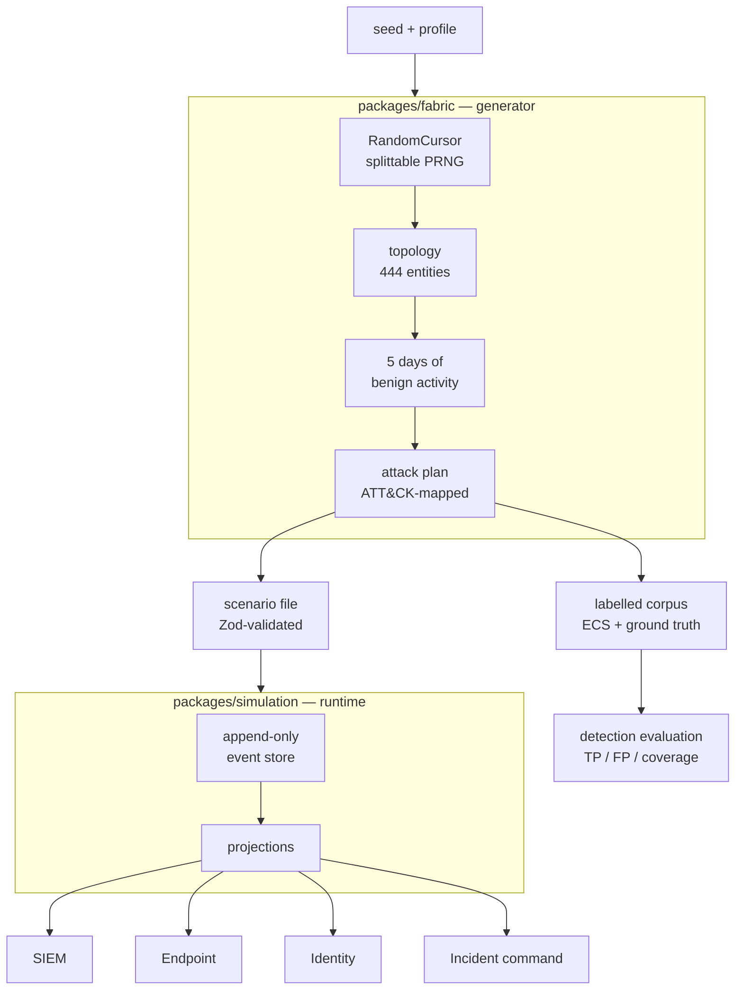

# Endomorph

**A deterministic generator of labelled enterprise security telemetry — attack and benign — with ground truth known by construction, so detections can be *measured* instead of estimated.**

**[Open the Detection Lab →](https://wallfacerj.github.io/endomorph/?lab)** · [Investigate an incident →](https://wallfacerj.github.io/endomorph/) · runs in a browser tab, no signup, no infrastructure.

A corpus captured from a real network has to be labelled by hand, and the labels are opinions. Endomorph inverts that: the generator decides which events are the intrusion *before* it writes them, so every record is labelled benign or malicious, mapped to the ATT&CK technique it demonstrates, and reproducible from a seed. That is the one thing a captured dataset cannot give you, and it is what makes a detection rule's precision and recall **counted** rather than guessed.

## What you can do with it

- **Score a detection rule against ground truth.** Paste **Sigma, KQL, SPL, EQL, or ES|QL** into the browser [Detection Lab](https://wallfacerj.github.io/endomorph/?lab) and get counted precision, recall, and ATT&CK coverage in under two seconds — with a drill-down into the exact benign events it fired on and the malicious ones it missed. A scored rule is a shareable link.
- **Gate a detection-rules repo in CI.** Score a whole ruleset on every pull request, fail on regression against a baseline, and emit a coverage badge for the README — [detection-as-code](docs/detection-as-code.md).
- **Benchmark against a stable corpus.** Nine seeded intrusions, 31 ATT&CK techniques, ~42k labelled events across endpoint, identity, network, DNS, file, mail, and cloud control-plane telemetry, with realistic false-positive noise — exportable as ECS / OCSF / Splunk.
- **Grade AI-generated detections.** The labelled corpus is a ground-truth eval set: [`--ai-eval`](docs/ai-detection-eval.md) hands an agent label-stripped tasks, and `--rubric` grades what it writes back — *N/M techniques detected to standard*.
- **Investigate the incidents by hand.** A full analyst console — SIEM, EDR, identity, live response, and an incident-command Case — over the same generated world, for training that cannot be memorised because changing the seed changes the enterprise while the reasoning holds.

Everything is deterministic and runs in the browser; the same seed reproduces the same world byte-for-byte.

```
pnpm evaluate     # score the shipped ruleset against nine ATT&CK-mapped intrusions
pnpm dev          # investigate one of them in the analyst console
```

## Why this is hard, and how it works

Determinism is the whole product. If the same seed produced a slightly different world, labels would drift from the data and every number above would be worthless.

The non-obvious part is that a single seeded PRNG is *not* enough. Drawing sequentially means adding one more device shifts every subsequent value, so editing content silently rewrites unrelated parts of the world. Endomorph uses a **splittable cursor** addressed by fork path rather than draw order:

```
root(seed)
  └── staff
        └── finance
              └── member-3      ← this person's stream, forever
```

Sibling streams cannot disturb each other and fork order is irrelevant. Raising headcount by one adds a person without changing anyone else's name, device, or account.



Everything downstream is derived. The SIEM, endpoint, and identity consoles are **projections of one event history**, not separate datasets — which is why a pivot in one tool lands on the same event in another, and why the incident-command graph can assemble itself from whatever evidence the analyst collected.

Content is data, not code. An attack plan declares its steps, techniques, and questions; the renderer plays it against whatever enterprise the seed produced. Adding an intrusion means adding a plan — and because plans pass through Zod validation, semantic reference checks, the runtime's own event validator, and the determinism suite, **generated content cannot corrupt the runtime**.

## Try Endomorph

**Hosted app:** https://wallfacerj.github.io/endomorph/

**Detection lab:** https://wallfacerj.github.io/endomorph/?lab — for detection engineers, not trainees: pick a generated scenario, see how a sample ruleset scores against its labelled corpus, then paste your own rule — in **Sigma, KQL, SPL, EQL, or ES|QL** — and get precision and recall counted against ground truth, with a drill-down into the exact benign events it fired on and the malicious ones it missed. A scored rule is a shareable link. No investigation to play through.

The app root is a short landing page explaining what Endomorph is, with doors into the lab and an investigation; every deep link (`?scenario=`, `?mode=`, `?lab`) still goes straight where it did.

The hosted build is deployed from `main` with GitHub Pages. If the deployment is temporarily unavailable, use the local quick start below.

For a first-time test, you do not need to read the repository first. The app opens with a short orientation on the alert queue naming the console each step happens in; follow that, or use [TESTER_GUIDE.md](TESTER_GUIDE.md) for the same procedure plus optional deeper checks.

### A single-file build

```bash
pnpm bundle:standalone                       # every scenario, one HTML file
pnpm --filter @endomorph/fabric bundle:standalone --   --scenarios=generated-enterprise,generated-macro    # a subset
```

`dist-standalone/endomorph.html` opens in a browser with no server and no network access — scenarios are gzipped and inlined, and the bundler verifies there are no external references. `--scenarios` names the ones to carry, for hosts with a size ceiling the product does not control; the point is that dropping a scenario stays an explicit decision rather than a silent cap on the plan library.

## What ships today

Endomorph includes:

- one deterministic synthetic enterprise world per scenario;
- shared identity, EDR, and SIEM projections over the same event history;
- an alert-first analyst workspace with SIEM, endpoint, identity, and incident-command views;
- a live-response console that asks a host what is true on it now, rather than what it did;
- a Case that assembles the incident picture from collected evidence: an evidence graph, extracted indicators, incident phase, hypotheses, tasks, and decisions;
- evidence collection by immutable event ID;
- analyst-authored findings linked to collected evidence;
- multiple deterministic response choices, including an intentionally harmful choice;
- explicit investigation finalization with success/failure and partial completion;
- transparent objective score, response-quality penalty, and final score;
- a read-only finalized case until reset;
- post-finalization instructor ground-truth review;
- an in-app detection lab, with its own front door at `?lab`: paste a rule in **Sigma, KQL, SPL, EQL, or ES|QL** and score it against the scenario's labelled corpus, with counted precision and recall, a false-positive/missed-event drill-down, and shareable result links;
- a coverage-badge SVG (`--badge`) and an AI-detection eval harness (`--ai-eval` / `--rubric`) for grading generated detections against ground truth;
- twelve scenarios selectable in the UI, three hand-authored and nine generated, spanning endpoint, identity, network, DNS, file, mail, and cloud control-plane telemetry;
- two persisted professional interface styles: **Midnight SOC** and **Graphite**;
- deterministic replay/unit/integration coverage plus browser-level Playwright tests;
- a deterministic enterprise generator (`packages/fabric`) producing hundreds of coherent entities and thousands of benign events from a seed.

## Included scenarios

| Scenario | Entities | Events | Notes |
| --- | --- | --- | --- |
| **Finance account compromise** | 15 | 34 | Suspicious login, encoded PowerShell, correlated outbound activity. |
| **HR malware beacon** | 7 | 6 | Compromised HR session, unsigned executable, outbound beacon. |
| **Cloud-admin compromise** | 7 | 6 | Privileged identity compromise and suspicious administrative tooling. |
| **Generated: external credential compromise** | 444 | ~20.1k | Password spray from hosting infrastructure, encoded PowerShell, C2 beacon, lateral movement. **Default.** |
| **Generated: phishing macro execution** | 444 | ~12.7k | A macro-enabled attachment spawns PowerShell from a word processor. The account is the genuine employee's; no authentication in the incident is anomalous. |
| **Generated: directory role elevation** | 444 | ~12.7k | Multi-factor prompts denied until one is approved, then a privileged role granted. No process runs on any workstation. |
| **Generated: privileged insider** | 444 | ~11.3k | No external address anywhere. A valid admin account, its own workstation, deviation from its own baseline. |
| **Generated: service account abuse** | 444 | ~11.3k | A valid privileged credential used from a host it has no history with. All traffic internal. |
| **Generated: dormant account revived** | 444 | ~11.3k | Every sign-in is unremarkable. The only anomalous event is an identity lifecycle change before any of them. |
| **Generated: credential phishing by link** | 444 | ~12.7k | A lookalike-domain lure and a link to a credential-harvesting host, then a valid-credential sign-in from an unfamiliar address. No malware runs; the whole chain is mail and identity. |
| **Generated: OAuth consent to cloud data theft** | 444 | ~12.7k | A malicious OAuth app is consented to, then a credential is minted, storage enumerated, and data copied to an external account. Nothing touches a host; it is entirely cloud control-plane. |
| **Generated: DNS tunnelling & exfiltration** | 444 | ~12.7k | A host beacons over DNS to algorithmically-generated domains and tunnels data out inside oversized TXT query names. No process or sign-in is anomalous; it lives only in the resolver log. |

The selector groups them, because they are not the same kind of thing. Generated scenarios carry ATT&CK mapping, scored investigation questions, and analytical reasoning on every walkthrough step; the hand-authored v1 scenarios predate the generator and are kept because they are small and fast.

Each generated incident is built to defeat the habit the previous one rewards, which is the part of the design that took the most judgement.

**External credential compromise** trains the obvious heuristic: an unfamiliar external address is suspicious.

**Privileged insider** breaks it. Everything originates from a legitimate admin on their own workstation, and the only signal is deviation from that person's own baseline.

**Service account abuse** breaks it again. The credential is valid and the traffic is internal, but the account is being used from a host it has never authenticated from.

**Dormant account revived** is not about authentication at all — a single identity lifecycle change, with no volume behind it for a threshold to catch.

**Phishing macro execution** begins with a process rather than a login. The account is the real employee's, signed in from their own device, and no authentication in the incident is anomalous, so an investigation that starts in Identity finds nothing to explain.

**Directory role elevation** never touches an endpoint at all — no process tree, no command line — so an analyst who has learned to pivot to the host finds a console with genuinely nothing in it.

**Credential phishing by link** is the first plan to exercise the mail domain, and it lives entirely in mail and identity: a lookalike-sender lure, a click to a credential-harvesting host, and a valid-credential login from a new address. There is no malware and no anomalous process — the earliest place to catch it is the message, but only with a rule specific enough to clear the ordinary external mail the background now carries.

**OAuth consent to cloud data theft** never touches a host at all: a user consents to a malicious application, and from the returned token an attacker mints a credential, enumerates storage, and copies data to an external account. The only record is the cloud audit log, and the earliest signal — the consent grant — is the one that looks most like ordinary administration, separated from a legitimate consent by the app's publisher and the scopes it asked for rather than the act of consenting.

**DNS tunnelling & exfiltration** is invisible to every console except the resolver log: no process is anomalous, no sign-in is out of place, and the traffic is ordinary port-53 lookups. A beacon resolves a rotating set of algorithmically-generated domains and then tunnels data out inside enormous TXT query names — so a rule that reads the *shape* of the name (its entropy and length) catches it, while one that alerts on "a DNS query" drowns in tens of thousands of benign lookups.

An analyst who works all nine cannot come away with a checklist, which is the point: any single heuristic fails on at least one of them.

Generated scenarios are **build artifacts, not source** — `pnpm build` produces them and they are not committed.

Use the **Scenario** selector in the application to switch between them. Direct deep links using `?scenario=/scenarios/<file>.json` are also supported for local/custom authoring.

## Live response

Every other console answers a historical question: what did this host do. A responder deciding whether to pull a machine off the network has a different one, and asks it of the machine — is that process still running, is the persistence still installed, who is signed in at this moment. Telemetry says a run key was written at 14:02; live response says it is still there now, and that is what decides whether the machine goes back to its owner.

Five commands, each labelled with the question it answers rather than the listing it produces: processes, connections, persistence, logons and file changes.

It invents nothing. Every fact is derived from events already in the corpus and already visible in the endpoint console, and only the framing changes. A live-response view that knew things the telemetry did not would be handing over the answer, and analysts would learn to run it first and think second.

**Persistence is an odd-one-out exercise, not a presence check.** Every host in the estate carries three to seven legitimate autorun entries — sync clients, chat, updaters, the asset agent — held as state on the device itself. Without that baseline the compromised machine was the only one in the estate with anything in the list, and "does this host have persistence" would have been the whole investigation. With it, the planted entry sits in alphabetical order directly beneath the real one:

```
OneDrive       HKCU\...\CurrentVersion\Run   "C:\Program Files\Microsoft OneDrive\OneDrive.exe" /background
OneDriveSync   HKCU\...\CurrentVersion\Run   C:\Users\Public\odsync.exe
Teams          HKCU\...\CurrentVersion\Run   "C:\Program Files\Microsoft Teams\current\Teams.exe" --minimized
```

An installer and a foothold write the same kind of record. Only the name and the directory tell them apart, which is the thing worth practising.

**It says when it does not know.** The sensor records process start and not process exit, so a process is called *running* only where something was attributed to it recently, *exited* only where the program is one that does its work and returns, and *unknown* otherwise — with the reason on every row. Real live response has exactly these gaps, and three states with their reasoning teach the job better than two states and a guess.

**Any host is selectable, deliberately.** An analyst who has only ever run a command on a compromised machine has no idea which part of the output was the finding. Running the same command against a machine you suspect and one you do not is how you learn what ordinary looks like.

**Containment does not cut you off.** Analysts routinely believe isolating a host loses them access to it and hesitate over containment for that reason. The agent channel is what survives — that is the point of containment — and the console says so at the moment somebody is deciding.

Because it reads the replayed event window rather than the whole corpus, rewinding the scrubber and running a command again shows what the host would have said then. "Was the persistence there yet when the alert fired" is answerable.

## Detection engineering

```bash
pnpm evaluate                          # score the shipped ruleset
pnpm evaluate -- --export out/corpus   # also write NDJSON + manifest
```

Rules are evaluated against every intrusion, because a rule's false positives come from the incidents it *wasn't* written for. Sample output:

```
External credential compromise  (credential-compromise)
  corpus 4045 records, 13 malicious (0.321%)

  RULE                      TECHNIQUE   TP   FP     FN   PREC    RECALL
  auth-spray                T1110.003   4    0      0    1.000   1.000
  encoded-powershell        T1059.001   1    0      0    1.000   1.000
  naive-powershell          T1059.001   1    51     0    0.019   1.000
  external-auth-success     T1078.002   1    0      1    1.000   0.500

  techniques covered   4/7
  UNCOVERED            T1005, T1021.002, T1071.001
```

Two of the shipped rules are deliberately imperfect, and the numbers say so. `naive-powershell` alerts on every PowerShell launch and scores **0.019 precision** — 1 true positive against 51 false. `external-auth-success` scores perfectly on the credential-compromise plan and **detects nothing at all** on the service-account plan, because that intrusion never leaves the corporate network.

Corpora export as newline-delimited JSON in Elastic Common Schema field names, with a manifest recording the seed, the plan, technique counts, and the malicious ratio.

### Does the rule generalise, or did it memorise?

A score against one world is worth less than it looks. A rule keyed on the exact address an intrusion happened to use scores a perfect recall on that world and catches nothing on the next one — and a captured corpus, having exactly one world, can never tell the two apart. A generated one can:

```bash
pnpm evaluate:robustness                 # score the ruleset across 20 seeded enterprises
pnpm evaluate -- --robustness 20 --json robustness.json
```

Each seed is an independently generated enterprise: different staff, hosts, and addresses; the same techniques. A rule that catches its technique on every seed is detecting behaviour; one whose recall collapses to zero on some seeds memorised a coincidence of this repository. Sample output:

```
  RULE                      TECHNIQUE   DETECTED  RECALL min/mean/max   FP mean/max   VERDICT
  auth-spray                T1110.003   20/20     1.00 1.00 1.00        0.0/0         STABLE
  naive-beacon              T1071.001   20/20     1.00 1.00 1.00        4277.3/4429   STABLE
  c2-exact-ip               T1071.001   7/20      1.00 0.35 1.00        0.0/0         FRAGILE

  techniques covered on every seed   15/15
  FRAGILE rules (miss their technique on at least one enterprise): c2-exact-ip
```

The verdict is on detection consistency; the false-positive columns carry the noise story separately, so `naive-beacon` reads as stable-but-deafening while a memorised rule reads as clean-but-fragile. `--robustness` exits non-zero when any rule is fragile, so a CI gate can hold a ruleset to generalising rather than to passing one lucky seed. This is the measurement a fixed dataset cannot make, and the reason a generated corpus is worth more than a captured one for detection work.

### Are the false positives realistic? Measured, not asserted.

The standing objection to synthetic detection data is that its false positives do not transfer: if the benign traffic is too clean, a rule scores zero false positives here and drowns in production. Endomorph answers that with a number rather than a promise.

```bash
pnpm noise-floor    # for each technique, how many benign events share its event types
```

```
  TECHNIQUE   MAL   BENIGN LOOK-ALIKES  PER MALICIOUS  EVENT TYPES
  T1059.001   1     863                 863x           PROCESS_STARTED
  T1071.001   3     1700                566.7x         NETWORK_CONNECTION
  T1110.003   4     29                  7.3x           AUTH_LOGIN_FAILED
  T1098.003   1     0                   0 (exposed)    ROLE_GRANTED

  24/31 techniques are buried among 10x or more benign look-alikes;
  2 are exposed (no benign event of their type -- a corpus with many of these would be too clean to trust).
```

Encoded PowerShell hides among 863 benign process starts; the C2 beacon among 1,700 benign connections. That is the false-positive floor for an unspecific rule keyed on the behaviour — a floor a corpus with separable malicious traffic cannot offer, because there is nothing benign to be confused with. It is a floor, not a verdict: a specific rule does better, and closing that gap is the detection engineer's job — but the floor establishes there is a gap to close.

The report is honest about its own gaps, too. The **exposed** techniques above are identity-lifecycle actions the background never performs benignly, so a rule keyed on "a role was granted" catches the intrusion with zero false positives — realistic for role grants, which are rare, but a signal that those techniques are easy here for a reason worth checking rather than trusting.

### The benchmark as one artifact

```bash
pnpm benchmark                               # write every plan's corpus + a manifest
pnpm evaluate -- --benchmark out/bench --format ocsf
```

A pile of NDJSON files is data; a benchmark is data with a manifest that says what it contains, so it can be scored against, cited, and diffed. `--benchmark` writes every intrusion's labelled corpus plus a top-level `benchmark.json`:

```
Endomorph Detection Benchmark v1.0
  seed 20260820  |  format ecs  |  6 plans
  ...
  42364 records, 72 malicious (0.170%), 31 techniques across 9 plans
```

The manifest carries aggregate counts, the union of techniques with how many plans exercise each and — from the noise floor — how buried each is, and a per-plan index pointing at the files. So the artifact says not only what it covers but how hard each technique is to detect cleanly, without a second command. The corpus files are byte-deterministic for a given seed, so two people who generate `v1.0` at the shipped seed hold identical telemetry — which is what lets a score computed against it mean the same thing to both of them.

### Deliverables and operator flags

The evaluation is also the engine behind the outputs a services team would
actually hand over.

```bash
pnpm evaluate -- --report coverage.html      # client-facing ATT&CK coverage report
pnpm evaluate -- --cohort-tool cohort.html   # instructor tool for comparing results
pnpm evaluate -- --profile client.json       # generate an estate shaped like a client's
pnpm evaluate -- --export out/corpus --format splunk --index endomorph
pnpm evaluate -- --sigma rules/sigma --badge coverage.svg   # README coverage badge
pnpm evaluate -- --ai-eval eval-set          # export a graded eval set for detection agents
```

**`--report`** writes a self-contained page: an ATT&CK matrix of what the
ruleset covers, every technique nothing caught named alongside the incidents
that used it, and rules ranked by the false positives they produced. It opens
from an email attachment with no network access.

**`--cohort-tool`** writes a page an instructor keeps. Analysts paste the
assessment records their runs exported and get a comparison — including which
question the group collectively missed, which names a gap in the teaching
rather than in a person. Nothing is uploaded.

**`--profile`** reshapes the generated estate to resemble a specific
environment: department names, host codes, subnets and naming convention. See
[`examples/client-profile.example.json`](examples/client-profile.example.json).
Determinism survives the reshaping, so a client-specific corpus is still
reproducible.

**`--format`** targets the platform the corpus is going into — `splunk`,
`elastic`, `sentinel` or neutral `ecs`. Labels travel with the data in every
format, which is the entire reason to move a corpus into somebody else's
platform: analysts can practise in the tool they use daily and engineers can
score their own rules there, because the answers came along.

### Bring your own rules — Sigma, KQL, SPL, EQL, ES|QL

Real Sigma YAML imports directly:

```bash
pnpm evaluate -- --sigma rules/sigma
```

```
Sigma import from rules/sigma
  imported 4, skipped 1
  SKIPPED unsupported_aggregation.yml: Aggregation conditions are not
          supported: "selection | count() by SourceIp > 5"
```

Sigma names fields the way Windows and Sysmon logs do; the corpus is ECS-shaped, so importing translates vocabularies (`Image|endswith` → `process.executable`) and maps `attack.t1059.001` tags to techniques. Supported: selections, negated filters, value lists under a modifier, `1 of selection_*`, and the `contains` / `startswith` / `endswith` / `re` modifiers.

`rules/sigma-compat/` holds rules written in genuine SigmaHQ idiom rather than tailored to this importer, so the compatibility claim is measured rather than asserted. **Four of six import**; the two refusals are honest — the corpus models neither parent process images nor Windows event IDs, so `ParentImage` and `EventID` have nowhere truthful to go.

#### Other query languages (KQL, SPL, EQL, ES|QL)

Most engineers don't write Sigma. The evaluator imports the *filtering* part of a query in four more dialects and scores it identically, so an author brings their own rule unchanged:

```bash
pnpm evaluate -- --kql rules/kql     # Microsoft Sentinel / Defender (Kusto)
pnpm evaluate -- --spl rules/spl     # Splunk (base-search wildcards, | search / | where)
pnpm evaluate -- --eql rules/eql     # Elastic EQL (<category> where <condition>, ECS-native)
pnpm evaluate -- --esql rules/esql   # Elastic ES|QL (FROM ... | WHERE ..., ECS-native)
```

The same detection expressed in KQL, SPL, EQL, and ES|QL scores an identical 1.000/1.000 — the importers agree because they compile to one internal rule. As with Sigma, a construct a subset can't express — a transforming command, a sequence, mixed AND/OR, an unmapped field — is refused **by name with a reason**, never imported as a query that silently matches nothing. All five languages are also a toggle in the browser Detection Lab.

#### Grading generated detections (AI eval)

Because the labels are ground truth, the corpus is an eval set for generated detections — from a person, an LLM, or an AI SOC agent. `--ai-eval` exports label-stripped telemetry plus a task prompt and a separate hidden answer key; `--rubric` grades a scored ruleset pass/fail per technique against a recall/precision bar:

```bash
pnpm evaluate -- --ai-eval eval-set          # export the tasks an agent detects on
pnpm evaluate -- --sigma candidate --rubric  # -> "15/30 techniques detected to standard"
```

See [docs/ai-detection-eval.md](docs/ai-detection-eval.md).

#### A coverage badge for a rules repo

```bash
pnpm evaluate -- --sigma rules/sigma --badge coverage.svg
```

A self-contained SVG (no external references) showing how many benchmark techniques the ruleset covers — commit it, or regenerate it from CI so it moves with the rules.

#### Detection regression testing

Rules are code and regress like code. Editing one to catch a technique routinely stops it catching another, and nothing surfaces that until an incident is missed.

```bash
pnpm evaluate:baseline                                  # record current performance
pnpm evaluate -- --baseline rules/detection-baseline.json   # fail if it regresses
```

The same loop gates a detection-rules repository in CI — score your Sigma rules on every pull request and fail on regression. See [docs/detection-as-code.md](docs/detection-as-code.md) and the adaptable [workflow](.github/workflows/detection-ci.example.yml).

```bash
pnpm evaluate -- --sigma path/to/your/rules --baseline detection-baseline.json
```

```
Baseline comparison against rules/detection-baseline.json
  REGRESSION   dormant-account-revival: Rule account-reenabled no longer fires
               here; it previously had 1 true positive(s).

Detection coverage regressed against the baseline.
```

Non-zero exit, so it gates CI — and it does, on every push.

Because the corpus is generated from a fixed seed, the comparison is **exact**: two runs produce identical numbers, so any difference is attributable to a rule change rather than to sampling. That is the property a captured corpus cannot offer.

It fails on lost technique coverage and on a rule that stops firing — the second matters because a coverage count alone hides it, since another rule can cover the same technique while a specific one quietly dies.

Everything else is reported as a **notice**: it prints, and it does not fail. Added false positives are a notice because trading noise for recall is a legitimate call an author may be making deliberately. So is a rule that starts matching *more* — usually the goal, but the same signature is produced by a corpus change nobody intended, and it should never happen silently. So is a new plan no rule covers.

A notice is not an improvement, and the distinction is the point: a rule that got noisier used to be reported in the same word as good news, which is a way of telling someone that reliably stops them looking.

#### The loop this enables

Adding the fourth attack plan showed the shipped ruleset detecting **nothing** on it — `techniques covered 0/4` — because no rule watched identity lifecycle. Two rules later (`account_reenabled`, `disabled_account_enumeration`) it reads `2/4`.

That is the whole argument for generating the corpus: the gap was a measurement, not a hunch, and closing it was verifiable.

The same loop runs in the other direction. The noise floor (above) flagged the identity-lifecycle techniques as *exposed* — the background never re-enabled an account or granted a role benignly, so `account_reenabled` scored a perfect 1.000 precision it would never see in production. Adding a handful of benign re-enables and non-privileged role grants to the background dropped that rule to a realistic ~0.3, because keying on "an account was enabled" catches the ones that are supposed to happen too. `privileged-role-grant` held at 1.000, because it keys on administrative roles and the benign grants were not — which is the lesson made concrete: specificity is what separates a usable rule from a noisy one, and the corpus now contains the noise that proves it.

**Anything the subset cannot express is refused, never skipped.** A rule that silently matches nothing is indistinguishable from coverage until an incident is missed, so aggregations, cross-selection disjunctions, and unmapped fields raise an error naming the reason. A test asserts every shipped rule fires against at least one corpus.

## Generating an enterprise

```bash
pnpm generate:scenario
```

That rebuilds `apps/web/public/scenarios/generated-enterprise.json` from a seed. The same flags always produce byte-identical output.

```bash
pnpm generate:scenario -- \
  --seed 4242 \
  --headcount 250 \
  --organization "Northwind Health" \
  --domain northwind.test \
  --out apps/web/public/scenarios/northwind.json
```

| Flag | Default | Meaning |
| --- | --- | --- |
| `--seed` | `20260820` | Root seed. Everything derives from it. |
| `--headcount` | `120` | Staff, distributed across nine weighted departments. |
| `--organization` | `Acme Financial` | Company name. |
| `--domain` | `acme.test` | Email/UPN domain. |
| `--start-time` | `2026-08-20T08:00:00.000Z` | Virtual start of the working day. |
| `--duration-hours` | `10` | Length of each generated working day. |
| `--out` | `apps/web/public/scenarios/generated-enterprise.json` | Output path, relative to the repository root. |
| `--plan` | chosen by seed | `credential-compromise`, `privileged-insider`, `service-account-abuse`, or `dormant-account-revival`. |
| `--days` | `5` | Days of baseline history before the intrusion. |
| `--pretty` | off | Indent the JSON. Roughly doubles file size. |

Register a new file in `apps/web/src/scenarioLoader.ts` to make it appear in the selector, or open it directly with `?scenario=/scenarios/<file>.json`.

### Why history matters

The generator produces **five consecutive days**, and the intrusion lands on the last one. Every earlier day is untouched baseline.

That is what makes an observation anomalous rather than merely unusual-looking. Each staff member keeps stable habits across the history — the same workstation, the same source address, a habitual handful of applications, a recognisable arrival time — and varies only within them. Weekends are quiet.

So when the compromised account signs in from `91.219.236.18`, an analyst can establish that the account has *never* used that address, on any prior day. Against a single day of telemetry that question has no answer.

Try it: open the generated scenario, go to **SIEM Search**, and query `sourceIp:91.219.236.18`. Five events out of 17,904 — four failed sign-ins, then a success.

### How determinism is guaranteed

Generation draws from a **splittable random cursor** rather than a single sequential stream. A cursor is addressed by its fork path — `staff/finance/member-3` — not by how many values have been drawn before it. Sibling streams cannot disturb each other, and fork order does not matter.

The practical consequence: raising `--headcount` by one adds a person without rewriting anyone else's name, device, or account. Editing content does not resequence the world.

## Analyst workflow

A normal run is intentionally simple:

1. Open the alert and investigate what happened.
2. Collect useful evidence and optionally write a case finding.
3. Choose the response action(s) you think are appropriate.
4. Finalize the investigation.
5. Review the result and score.

Neither Guided nor Professional reveals ground truth or authored response-quality rationale before submission. Only Instructor does, and only after finalization.

## Replay

Every console is a projection of one append-only event log, so point-in-time replay is a prefix replay rather than stored snapshots. Scrub the timeline and the SIEM, endpoint, identity, and case views all show that moment together — rewind past the alert and watch the intrusion arrive instead of reconstructing it backwards from the end.

Response actions are disabled while rewound. Acting on a past state would either rewrite history or silently apply to the present, and both are worse than refusing.

### Counterfactuals

Rewinding shows what the incident looked like earlier. The question that changes behaviour is what would have happened if you had decided differently — and because the runtime is deterministic and response actions are declarative, that is *computed*, not simulated.

At finalization the result reports what the best available sequence would have scored and attributes a delta to each individual decision:

```
Performed   Disable compromised account        +50   Worth 50 points.
Not taken   Isolate the workstation              0   Would not have changed the score.
Performed   Restore account access             −50   The run scores higher without it.
```

Order matters, materially: re-enabling an account after disabling it undoes the containment, so the same three operations score 25 or 75 depending on sequence. The search therefore covers orderings rather than sets, and reports whether optimality was proven or approximated.

## Instructor walkthrough

Switch the **Role** control to Instructor and open **Walkthrough**. It reconstructs the incident step by step from ground truth: what happened, which console to look in, the ATT&CK technique, and a query to try.

Steps reveal one at a time on an explicit click — collapsed steps show only the console name, so the shape of the incident is visible without the content. **Pop out** detaches it into a separate window for a second monitor or a projector, rendered through a portal so it stays in sync with the run.

Students get the walkthrough after finalizing; instructors get it during.

## Professional and guided modes

Runs default to **professional**: no live objective checklist and no running score while you work. The evidence, tools, and response actions are identical — only the answer key is absent. Assessment appears in full once you finalize.

**Guided** restores the checklist and running score for onboarding, layered onto the same environment rather than a separate, simpler product. Switch with the **Mode** control; the choice persists across reloads.

## Instructor mode

Use the **Instructor mode** control in the app, or add `?mode=instructor` to a scenario URL. Ground truth is shown only after the investigation is finalized.

Instructor mode is a **presentation boundary, not an authentication/security boundary** in v1. The current product is a local/static client application. Do not use this mode to protect assessment answers in a real classroom deployment; real role enforcement belongs in a future server-backed runtime.

## Local quick start

Requirements:

- Node.js 24
- pnpm 11.22.0 (the repository declares the package-manager version)

```bash
git clone https://github.com/WallFacerJ/endomorph.git
cd endomorph
pnpm install --frozen-lockfile
pnpm dev
```

Open the Vite URL printed in the terminal, normally `http://localhost:5173`.

## Validation commands

```bash
pnpm build
pnpm lint
pnpm test:run
```

For browser regression tests:

```bash
pnpm exec playwright install chromium
pnpm test:e2e
```

CI runs frozen dependency installation, build, lint, deterministic unit/integration tests, and the Chromium Playwright suite.

## First-time user testing

For a friend or first-time tester, the preferred procedure is deliberately short:

1. Share the hosted app: https://wallfacerj.github.io/endomorph/
2. Ask them to leave **Assistance** on **Guided** and follow the orientation the app shows on first open.
3. Do not tell them the correct investigation or response path.
4. After they finalize, ask where they hesitated, whether the result made sense, and what one thing they would change.

That five-minute pass is enough to produce useful usability feedback. [TESTER_GUIDE.md](TESTER_GUIDE.md) contains optional deeper checks and a copy/paste feedback template for testers who want to do more.

## Scenario authoring

Shipped scenarios live in `apps/web/public/scenarios/` and use the versioned `endomorph-scenario` JSON contract. The scenario compiler performs structural validation with Zod, semantic world/event/reference validation, deterministic replay validation, objective validation, response-action validation, and ground-truth reference validation before a scenario is allowed into the workspace.

See [SCENARIO_AUTHORING.md](SCENARIO_AUTHORING.md) for the authoring contract and workflow.

## Architecture boundaries

Endomorph deliberately keeps these concepts separate:

- **World state** is the canonical synthetic enterprise state.
- **Simulation events** form append-only deterministic history.
- **Identity / EDR / SIEM** are projections of shared history, not private sources of truth.
- **Analyst case state** stores collected event IDs and analyst-authored findings, not duplicated canonical telemetry.
- **Objectives** grade resulting canonical state.
- **Response-quality penalties** come only from declarative scenario metadata for performed actions.
- **Ground truth** is authored assessment metadata and is not student-visible during an active investigation.

The current hosted application is intentionally client-only and in-memory. Refreshing the page starts a fresh run. Durable users/runs, real authentication/authorization, persistence, plugins, and server APIs are post-v1 work.

## Safety boundary

Endomorph is for synthetic simulation only. It is not a phishing kit, credential-capture system, arbitrary code-execution framework, or production security-control platform. Do not enter real credentials, secrets, personal information, or production incident data into test findings.

## Repository map

- `apps/web` — React + TypeScript + Vite analyst/instructor experience
- `packages/domain` — canonical synthetic enterprise domain models
- `packages/schema` — versioned external/scenario validation contracts
- `packages/simulation` — deterministic world/event/replay/projection/scenario runtime
- `packages/fabric` — the generator: splittable RNG, topology, background activity, the attack-plan library, labelled corpus export, detection-rule evaluation, and the CLIs
- `e2e` — Playwright browser regression tests

For architectural continuity and future work, see [PROJECT_STATE.md](PROJECT_STATE.md), [ROADMAP.md](ROADMAP.md), and [ARCHITECTURE.md](ARCHITECTURE.md).
